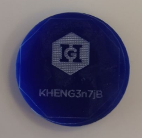
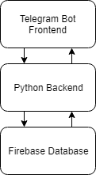
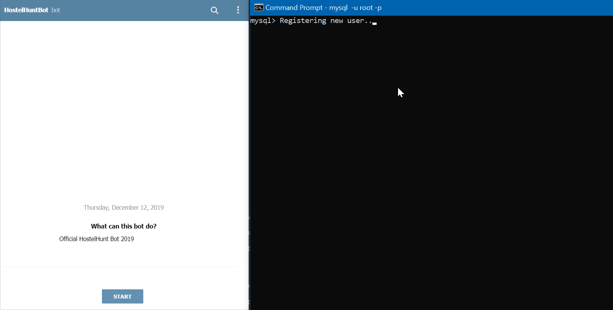
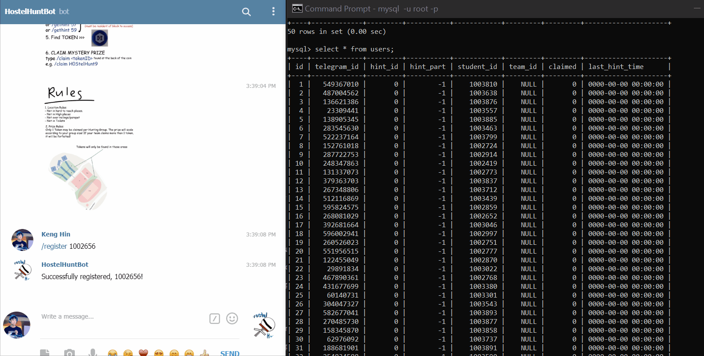
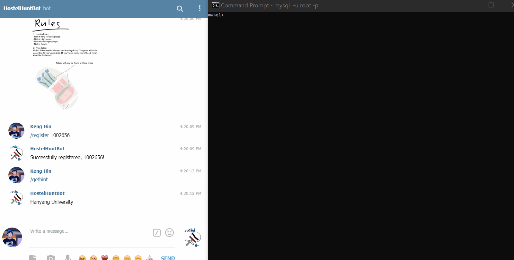

# Hostel Hunt

## Description

Hostel Hunt is a "treasure hunting" game for hostel residents at Singapore University of Technology and Design. Players are to form groups of 4 (max) to participate in the game. The game is administered using a chat-bot on Telegram. 

## Objective

The objective of the game is to find tokens that are secretly hidden over a specified play area.

Hints leading to the tokens are given to the player via the Telegram chat-bot.

When players find the tokens, they must enter a 10 alpha-numeric code found at the back of the token into the chat-bot to claim the prize (for verification purpose)

## Key Design Features

1. Token ID are UNIQUE to track which tokens have been found

2. users Table to track players' progress in the game (Whether he/she has found a prize? Which hint number he/she is at?)

3. hints Tables to store information of hints (3 hints per token)

## Software Architecture Overview

### Telegram Bot Frontend

The telegram chat-bot allows users to register themselves into the game, receive instructions/hints and register their prize. 

## Database Schema

database_scripts/schema.sql

## Demo

### Database Initialization

### User Registration

### User Get Hint

### Claim Prize

